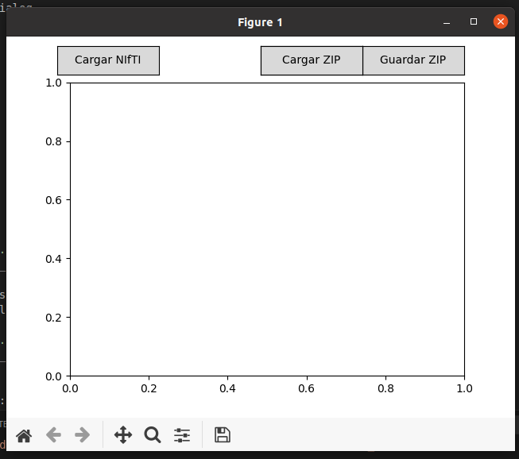
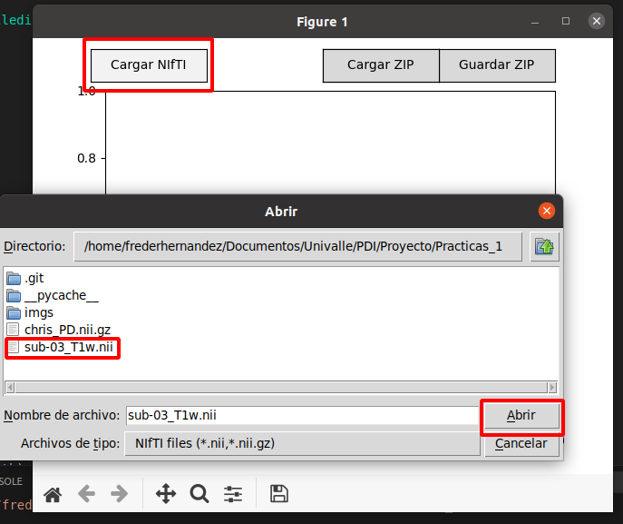
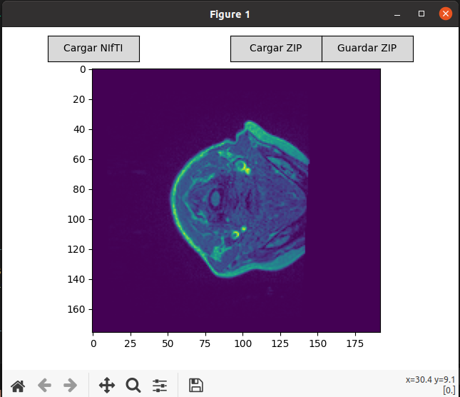
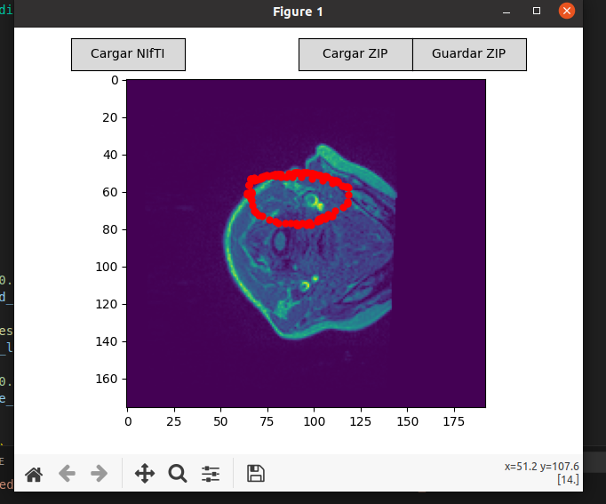
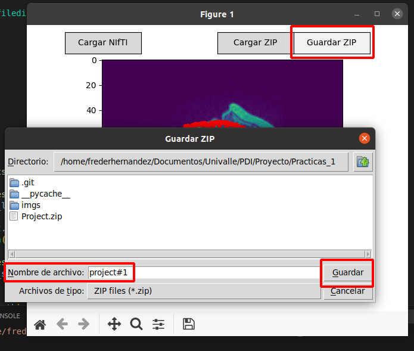
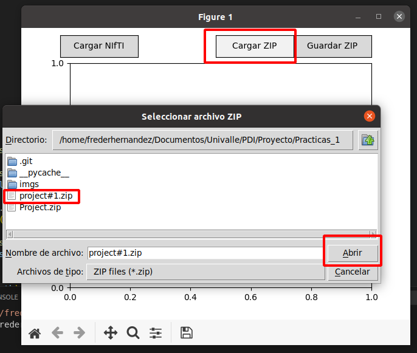

# PDI - NIfTI Viewer & Annotation Tool

A Python-based GUI application for visualizing NIfTI medical images, annotating slices with points, and saving/loading data in a ZIP format.

## Features
- Load and display NIfTI (.nii, .nii.gz) medical images.
- Scroll through slices using the mouse wheel.
- Annotate images by clicking to add points.
- Erase points.
- Save the annotated NIfTI file and points in a ZIP file.
- Load previously saved ZIP files with image and annotations.

## Screenshots

### Application Interface


### Loading a NIfTI File


### NIfTI File Loaded


### Drawing Annotations


### Saving Annotations & Image


### Loading a ZIP File


## Installation

### Prerequisites
Ensure you have Python installed (>= 3.7) and install the required dependencies:
```sh
pip install nibabel matplotlib tkinter
```

## Usage
Run the application using:
```sh
python main.py
```

## Controls
- **Load NIfTI**: Open a NIfTI file.
- **Scroll**: Navigate through slices.
- **Click**: Add a point.
- **Erase Mode**: Toggle erase mode to remove points.
- **Save ZIP**: Save the NIfTI and annotations.
- **Load ZIP**: Reload a previously saved ZIP file.

## License
MIT License

