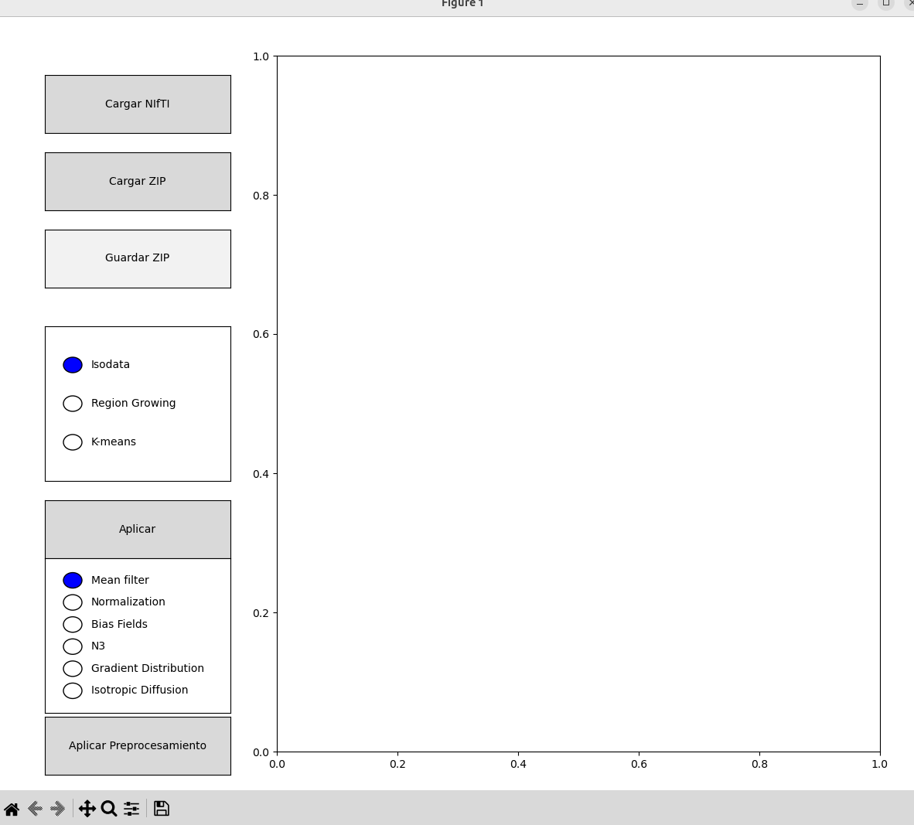

# PDI - NIfTI Viewer & Annotation Tool

A Python-based GUI application for visualizing NIfTI medical images, annotating slices with points, and saving/loading data in a ZIP format.

## Features
- Load and display NIfTI (.nii, .nii.gz) medical images.
- Scroll through slices using the mouse wheel.
- Annotate images by clicking to add points.
- Erase points.
- Save the annotated NIfTI file and points in a ZIP file.
- Load previously saved ZIP files with image and annotations.
- **Image Segmentation**:
  - Apply segmentation algorithms such as:
    - Isodata Thresholding
    - Region Growing
    - K-means Clustering
- **Image Preprocessing**:
  - Apply preprocessing algorithms such as:
    - Mean Filter
    - Normalization
    - Bias Field
    - N3
    - Gradient Distribution
    - Isotropic Diffusion

## Screenshots

### Application Interface


### Loading a NIfTI File


### NIfTI File Loaded


### Drawing Annotations


### Saving Annotations & Image


### Loading a ZIP File


### Segmentation


### Preprocesing


## Installation

### Prerequisites
Ensure you have Python installed (>= 3.7) and install the required dependencies:
```sh
pip install nibabel matplotlib tkinter
```

## Usage
Run the application using:
```sh
python main.py
```

## Comparison of Segmentation Algorithms

| **Algorithm**        | **Advantages**                                                                                                                                                                                    | **Disadvantages**                                                                                                                                           |
|----------------------|---------------------------------------------------------------------------------------------------------------------------------------------------------------------------------------------------|-------------------------------------------------------------------------------------------------------------------------------------------------------------|
| **Isodata Thresholding** | - It consumes few resources by working directly with the matrix average average                                                                                               | Working exclusively with the average of the whole matrix and not having a good distribution of intensities, the segmentation may not be the best.           |
| **Region Growing**       | It can be more precise when segmenting since it works directly on the image pixels and their neighbors.  It can be more precise since we can choose a specific point to perform the segmentation. | Much more time-consuming to iterate over the set of pixels and their neighbors.                                                                             |
| **K-means**             | It is a more optimal alternative because although it works with the entire matrix it seeks to group its clousters randomly, and depending on the tolerance it can converge faster.                | Although it can converge fast, if it is not the case it can be too expensive because it does not have an appropriate threshold or it is a very large image. |

## Comparison of Preprocessing Algorithms

| **Algorithm**       | **Advantages**                                                                                                          | **Disadvantages**                                                                                                                                 |
|---------------------|-------------------------------------------------------------------------------------------------------------------------|---------------------------------------------------------------------------------------------------------------------------------------------------|
| **Mean filter**         | - Easy and fast implementation - It consumes few resources by working directly with the matrix average                  | Working exclusively with the average of the whole matrix and not having a good distribution of intensities, the segmentation may not be the best. |
| **Normalization**       | - Easy to implement - Useful to standardize images before working with them. - Not very computationally expensive       | Does not reduce noise or apply significant change to the image.                                                                                   |
| **Bias Field**          | - Easy to implement - Improves image intensity. - Not very computationally expensive                                    | When performing all operations on the matrix does not discriminate edges or other values well.                                                    |
| **N3**                  | - More accurate in determining bias. - Preserves image detail better                                                    | - It is more expensive due to the iterations on the matrix. - If a good tolerance is not established, we could have inappropriate values.         |
| **Isotropic Diffusion** | - Easy to implement - Smoothes the image without compromising the edges by working equally with all layers of the image | Improper tolerance can result in loss of information                                                                                              |

## Controls
- **Load NIfTI**: Open a NIfTI file.
- **Scroll**: Navigate through slices.
- **Click**: Add a point.
- **Erase Mode**: Toggle erase mode to remove points.
- **Save ZIP**: Save the NIfTI and annotations.
- **Load ZIP**: Reload a previously saved ZIP file.

## License
MIT License

